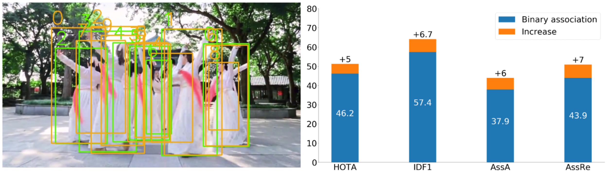
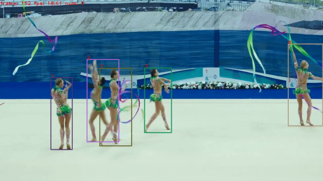

# PKF: Probabilistic Data Association Kalman Filter

[\[paper\]](https://arxiv.org/pdf/2411.06378) **PKF** is a new Kalman filter with probabilistic data association, We derive it by formulating the estimation problem with unknown data association via Expectation-Maximization (EM). We apply it to the multi-object tracking (MOT) task and it can achieve better ID assignment in scenes with high ambiguity compared with other Kalman-filter-based trackers.

### Probabilistic data association 
<center>

</center>

In the above figure, the green boxes are detections and the orange boxes are tracks. It shows how probabilistic data association increase the ID assignment quality according to IDF1, association accuracy (AssA), association recall (AssRe), and the combined HOTA metric.

## Get Started
* See [INSTALL.md](./docs/INSTALL.md) for instructions of installing required components.

* See [GET_STARTED.md](./docs/GET_STARTED.md) for how to get started with PKF.

* See [MODEL_ZOO.md](./docs/MODEL_ZOO.md) for available YOLOX weights.

## Demo
To run our PKF tracker on a provided demo video, download it from [google drive](https://drive.google.com/file/d/1lw22C7k7-uWJepnueJeVLwJrOcZ9Y8qg/view?usp=sharing) and put it under the root folder of the code.

```shell
python tools/demo_track_pkf.py --demo_type video \
    -f exps/example/mot/yolox_dancetrack_test.py -c pretrained/ocsort_dance_model.pth.tar \
    --path demo.mp4 --fp16 --fuse --save_result --out_path demo_out.mp4 \
    --ambig_thresh 0.9 --update_weight_thresh 0.3 --use_ocm --use_ocr
```
or use the shell file [demo_pkf.sh](sh_scripts/demo_pkf.sh).

<center>

</center>

## Citation
If you find this work useful, please consider to cite our paper:
```
@inproceedings{cao2024pkf,
  title={PKF: Probabilistic Data Association Kalman Filter for Multi-Object Tracking},
  author={Cao, Hanwen and Pappas, George J and Atanasov, Nikolay},
  journal={arXiv preprint arXiv:2411.06378},
  year={2024}
}
```
